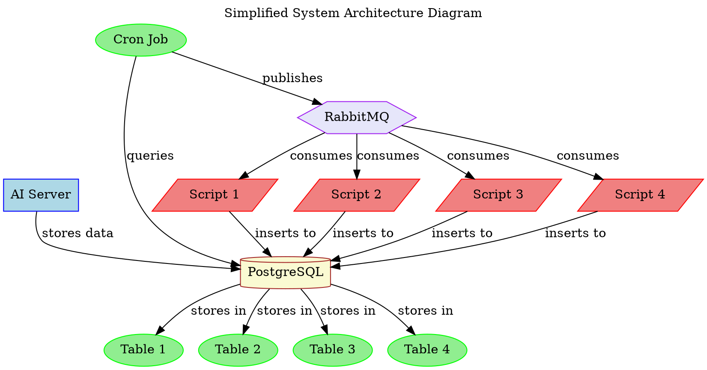

Designing for a better balance of complexity and security involves streamlining the architecture while ensuring robust security measures. Here are some suggestions:

### Simplified and Secure Architecture

1. **Unified Database**: Replace the dual-database system with a single, secure PostgreSQL database to reduce complexity and enhance data consistency.
2. **Direct Communication**: Minimize the number of hops data must take by allowing scripts to directly query the PostgreSQL database when needed.
3. **Secure Messaging**: Ensure secure communication between components using encrypted channels and proper authentication mechanisms.

### Updated Architecture Diagram

### Explanation

1. **Single Database**:
   - **PostgreSQL** serves as the sole database, storing all data from the AI Server and scripts. This reduces the complexity of managing multiple databases and ensures data consistency.
   - Each script writes to a specific table within PostgreSQL.

2. **Direct Communication**:
   - The Cron Job queries PostgreSQL directly and publishes messages to RabbitMQ.
   - Scripts consume messages from RabbitMQ and directly insert data into PostgreSQL, reducing the number of intermediate steps.

3. **Security Measures**:
   - **Encryption**: Use SSL/TLS to encrypt all communications between the AI Server, PostgreSQL, RabbitMQ, and the scripts.
   - **Authentication**: Implement strong authentication mechanisms for accessing PostgreSQL and RabbitMQ.
   - **Access Control**: Apply least privilege access control, ensuring each component can only access the data and resources it needs.

4. **Centralized Logging and Monitoring**:
   - Implement centralized logging and monitoring to track system activities, detect anomalies, and respond to incidents promptly.

### Strengths

1. **Reduced Complexity**: Simplifying the architecture by using a single database reduces the complexity of managing and maintaining the system.
2. **Enhanced Security**: Secure communication and strong authentication mechanisms protect data integrity and confidentiality.
3. **Improved Performance**: Reducing the number of intermediate steps can decrease latency and improve overall system performance.
4. **Easier Maintenance**: With fewer components to manage, system maintenance becomes more straightforward.

### Weaknesses

1. **Single Point of Failure**: PostgreSQL becomes a critical component. Its failure can disrupt the entire system. Implementing redundancy and failover mechanisms is essential.
2. **Scalability**: While this architecture simplifies the system, it may limit horizontal scalability compared to a microservices architecture.

### Trade-offs

1. **Simplicity vs. Scalability**: Simplifying the architecture improves manageability but might constrain scalability. However, PostgreSQL can be scaled vertically or sharded if needed.
2. **Security vs. Flexibility**: Implementing strong security measures may introduce some complexity but is necessary to protect sensitive data.

### Conclusion

This simplified architecture balances complexity and security by reducing the number of components and focusing on robust security measures. It ensures data consistency and improves maintainability while providing a scalable foundation for future growth.