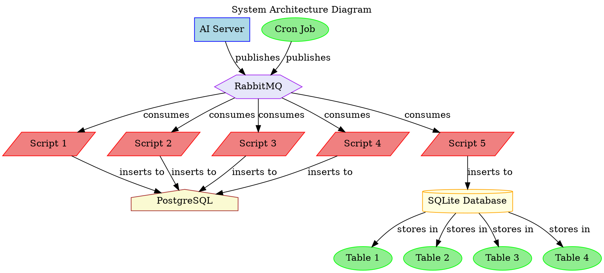

Certainly! Here's an updated version of the architecture where the AI Server sends data directly to the RabbitMQ queue. A fifth script consumes messages from RabbitMQ and inserts data into different tables in a SQLite database based on the topic.

### Updated Architecture Diagram

### Explanation:
1. **Nodes**:
    - **AI_SERVER**: Represents the AI server, colored light blue.
    - **SQLite_DB**: Represents the SQLite database, colored light yellow.
    - **Cron_Job**: Represents the cron job, colored light green.
    - **RabbitMQ**: Represents the RabbitMQ topic, colored lavender.
    - **Script_1, Script_2, Script_3, Script_4**: Represent the scripts consuming from RabbitMQ and inserting data into PostgreSQL, colored light coral.
    - **Script_5**: Represents the script consuming from RabbitMQ and inserting data into the SQLite database, colored light coral.
    - **PGSQL**: Represents the PostgreSQL database, colored light goldenrod yellow.
    - **table_1, table_2, table_3, table_4**: Represent the tables in the SQLite database where Script_5 writes data based on the topic, colored light green.

2. **Edges**:
    - **AI_SERVER** publishes data directly to **RabbitMQ**.
    - **Cron_Job** queries data and publishes results to **RabbitMQ**.
    - **RabbitMQ** distributes messages to **Script_1, Script_2, Script_3, Script_4, and Script_5**.
    - **Script_1, Script_2, Script_3, Script_4** insert data into **PostgreSQL**.
    - **Script_5** inserts data into the **SQLite Database**, which distributes it to the respective tables based on the topic.

3. **Ranking**:
    - The `rank=same` attribute ensures that `Script_1`, `Script_2`, `Script_3`, `Script_4`, and `Script_5` are on the same level for better visualization.

### Strengths and Weaknesses

#### Strengths:
1. **Asynchronous Processing**: RabbitMQ ensures messages are processed asynchronously, enhancing system responsiveness and resilience.
2. **Modularity**: Each component (AI Server, Scripts, Databases) can be independently developed, maintained, and scaled.
3. **Flexibility**: The architecture allows for easy addition of new consumers or publishers without significant changes to the overall system.
4. **Data Segregation**: Different scripts handle specific tasks, and data can be stored in the appropriate tables based on the topic.

#### Weaknesses:
1. **Complexity**: Managing multiple scripts and ensuring data consistency across different databases can be complex.
2. **Latency**: Additional components (RabbitMQ, multiple scripts) can introduce latency in the data processing pipeline.
3. **Single Point of Failure**: RabbitMQ becomes a critical component. If it fails, the entire messaging system can be disrupted.

### Security Implications
1. **Data Security**: Ensure all communication channels (e.g., RabbitMQ, database connections) are encrypted using SSL/TLS to protect data in transit.
2. **Access Control**: Implement strict access control policies to limit access to databases and messaging queues to authorized entities only.
3. **Authentication**: Use strong authentication mechanisms for all components to prevent unauthorized access.
4. **Monitoring and Auditing**: Implement robust monitoring and auditing to track activities and detect any anomalies or security breaches.

### Architectural Style
This architecture follows a **Microservices Architecture** pattern with asynchronous messaging. Each script and component acts as an independent microservice, interacting through a message broker (RabbitMQ).

### Trade-offs
1. **Complexity vs. Flexibility**: The architecture's flexibility and modularity come at the cost of increased complexity in managing and orchestrating the various components.
2. **Performance vs. Resilience**: The use of RabbitMQ enhances resilience but may introduce performance overhead due to additional hops and message handling.
3. **Scalability vs. Manageability**: While the architecture is highly scalable, managing multiple components and ensuring their proper coordination can be challenging.

### Conclusion
This architecture provides a flexible, scalable, and resilient solution for processing and storing data. However, it requires careful management of complexity and strong security measures to protect data integrity and confidentiality. Implementing centralized logging, monitoring, and robust access controls will help maintain the system's security and operational efficiency.